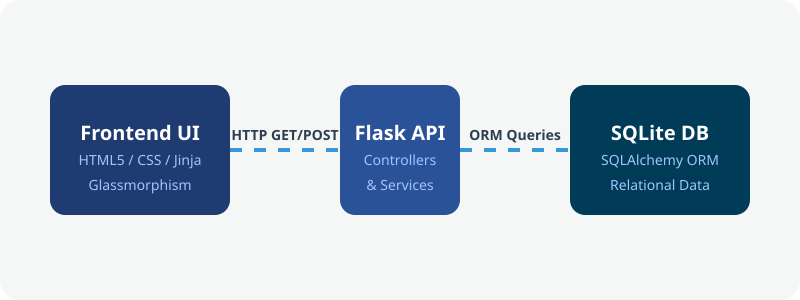
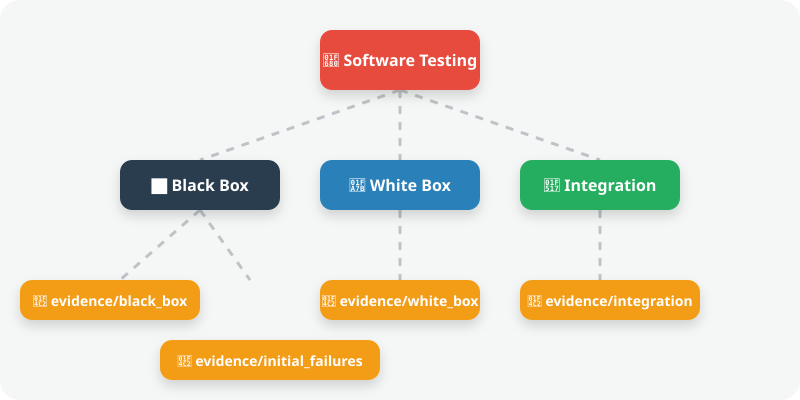

<div align="center">
  
  <h1 align="center">Payroll Management System 💻</h1>
  <p align="center">
    <b>An Advanced Academic Software Testing Showcase (A to Z)</b>
  </p>
  
  [](#)
  [](#)
  [](#)
  [](#)
</div>

---

Welcome to the **Payroll Management System (System Under Test)** built specifically by **Team 11** for an advanced Software Testing academic exercise.

This repository is an exhaustive demonstration of the Software Testing Lifecycle (STLC). We built a functional web application, intentionally seeded it with defects, and systematically executed manual and automated tests against it using industry-standard techniques.

---

## 🏗️ 1. Dynamic Architecture Flow

The System Under Test (SUT) is built using a modern, lightweight web architecture. Below is the interactive flow of how our layers communicate:

<div align="center">
  
</div>

---

## 🧪 2. Testing Techniques & Evidence Mapping

We separated our testing artifacts into highly organized directories. Below is the interactive map showing which folders correspond to which testing techniques:

<div align="center">
  
</div>

---

## 📖 3. Detailed Explanation of Techniques

### ⬛ A. Black-Box Testing
*Testing functionality without peering into internal code structures. Driven by Playwright UI automation.*
- **Equivalence Class Partitioning (ECP)**: Dividing data into valid/invalid partitions. We used this on Employee form fields (e.g., Names only accept alphabets).
- **Boundary Value Analysis (BVA)**: Testing the extreme edges of ranges to catch off-by-one errors. We used this for Basic Salary bounds (`10,000` to `500,000`).
- **Cause-Effect Graphing**: Mapping specific inputs to specific outcomes. Used for Attendance logic (e.g., rejecting submissions where `Present Days > Working Days`).
- **Decision Table Testing**: Used for complex multi-condition rules, specifically our Income Tax brackets (10% vs 20%) and Professional Tax evaluations.

### 🩻 B. White-Box Testing
*Testing the internal code structures and logic paths. Driven by Pytest and Pytest-Cov.*
- **Statement & Branch Coverage**: We wrote automated unit tests targeting `app/services/payroll_service.py` to ensure every mathematical operation, IF statement, and edge case is executed by a test. **(Achieved 99% Code Coverage)**.

### 🔗 C. Integration Testing
*Testing communication between components. Driven by Pytest end-to-end endpoints.*
- Verified that submitting an employee via the UI Route successfully inserts data into the SQLite Database, and successfully triggers the automated Salary configuration Service in cascade.

---

## 📋 4. Test Cases & Defect Resolution (The "A to Z")

We executed **73 total Test Cases** during our cycle. We intentionally seeded the app with defects, captured them in `evidence/initial_failures`, fixed them, and re-tested them.

### Comprehensive Test Case Matrix

<div align="center">

| Test ID | Module | Technique | Test Scenario | Status | Defect Found |
|:-------:|:-------|:----------|:--------------|:------:|:-------------|
| **TC-001** | Authentication | Positive | Login with valid credentials | ✅ Pass | - |
| **TC-002** | Authentication | BVA (Empty) | Login with empty fields | ✅ Pass | - |
| **TC-010** | Employee | ECP (Valid) | Add employee with valid inputs | ❌ Fail | **BUG-011** (Flash Message Color) |
| **TC-011** | Employee | BVA (Min Limit) | Basic Salary = ₹10,000 | ✅ Pass | - |
| **TC-012** | Employee | BVA (Max Limit) | Basic Salary = ₹500,000 | ❌ Fail | **BUG-001** (Accepted invalid boundary) |
| **TC-020** | Attendance | BVA | Present Days = Working Days | ✅ Pass | - |
| **TC-021** | Attendance | Cause-Effect | Present Days > Working Days | ❌ Fail | **BUG-002** (Bypassed logic) |
| **TC-030** | Payroll | Decision Table | Calculate Gross Salary | ❌ Fail | **BUG-003** (Conveyance omitted) |
| **TC-031** | Payroll | Decision Table | Tax Calc for Salary > 30k | ❌ Fail | **BUG-005** (Calculated at 10% not 20%) |
| **TC-032** | Payroll | Decision Table | Calculate Professional Tax | ❌ Fail | **BUG-008** (Always returned 0) |
| **TC-034** | Payroll | State Transition | Generate Payroll same month, diff year | ❌ Fail | **BUG-004** (Falsely flagged duplicate) |
| **TC-040** | Dashboard | UI/UX | Verify Analytics Panel Title | ❌ Fail | **BUG-010** (Typo injected) |

</div>

### 🛠️ How We Resolved The Defects

During our defect lifecycle, we fixed all identified bugs. Here is exactly how we resolved some of the major logical failures:

#### 1. BUG-001: Boundary Value Analysis Failure
- **The Bug**: The system incorrectly allowed a Basic Salary of exactly ₹500,000, violating the rule that it must be strictly less than 500,000.
- **The Fix**: We updated the comparison operator in the validation route from `>=` to `>`.
  ```python
  # Before
  if basic_salary >= 500000:
  
  # After
  if basic_salary > 500000:
  ```

#### 2. BUG-002: Cause-Effect Validation Bypass
- **The Bug**: The system bypassed the critical validation check (`Present Days > Working Days`) if the user inputted `0` for `Leave Days`.
- **The Fix**: We decoupled the validation so it runs regardless of the leave days input.
  ```python
  # Before
  if leave_days == 0 and present_days > working_days:
      pass # Intentionally flawed bypass
  
  # After
  if present_days > working_days:
      raise ValueError("Present days cannot exceed working days.")
  ```

#### 3. BUG-005: Decision Table Tax Rule Violation
- **The Bug**: For employees with a gross salary over ₹30,000, income tax was calculated at a flat 10% instead of the mandated 20% bracket.
- **The Fix**: We updated the constant multiplier in the `payroll_service.py` calculation engine.
  ```python
  # Before
  if gross_salary > 30000:
      income_tax = gross_salary * 0.10
      
  # After
  if gross_salary > 30000:
      income_tax = gross_salary * 0.20
  ```

---

## 🚀 5. How to Run the Project

**1. Install Dependencies**
```bash
pip install flask flask-sqlalchemy pytest pytest-cov pytest-html playwright python-docx python-pptx
playwright install chromium
```

**2. Start the Application**
```bash
python run.py
```
*Access the beautiful Glassmorphism UI at `http://127.0.0.1:5000` (Creds: admin / admin123)*

**3. View the Interactive Presentation Materials**
Open **`presentation_test_sheet.html`** in your browser for a stunning, interactive DataTables matrix of our test cases! Alternatively, open the generated assets inside the `report/` (DOCX) and `presentation/` (PPTX) folders.

---
<div align="center">
  <i>Developed & Tested by Team 11</i>
</div>
